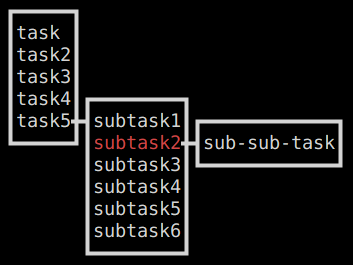

# To Do List
CLI todo list, written in python with curses

## Installation:

clone the repository and run `python ./src/main.py ./test.json`. Replace `test.json` with a custom tasklist and link to it in the CLI argument.

## Usage:

- Navigate with the arrow keys.
- Press shift along with an arrow key to create a task.
- Press `Enter` to toggle between edit and view modes
- Press `Delete` to toggle completeness of a task
- Press `Q` to safely exit the program and save changes to the list

## Overview:

Each task is a node in a tree, with each node storing its children in an ordered list. Tasks with no subtasks are leaf nodes. The root of the tree is a `TODO` task, which is not viewable or editable via the CLI.

Colors and input controls can be edited in `conf.py`.

